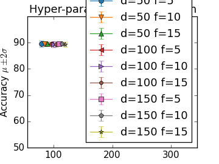

# Dreem Challenge 21/05/2016

Data-driven EEG signal quality estimation.


## Introduction

The objective is to implement an algorithm that is able to assess the quality EEG signals, on the basis of a reference dataset of manually labelled samples.

The following steps will be performed:

* Dataset exploration: analysing the structure and properties of train and test datasets.

* Fitting a Random Forest model: training a plain random forest model with the train dataset and evaluating its performance.

* Hyper-parameter tuning: selecting random forest parameters in order to improve accuracy on the train set.

* EEG signal quality estimation: performing classification task on test datasets using the best performing random forest model.


## Dataset exploration
Three datasets are provided: `quality_dataset.h5`, `record1.h5` and `record2.h5`.

`quality_dataset.h5` is the train dataset with 137,030 samples. Each sample represents 2 's' of a single EEG channel recording sampled at 250 'Hz' (yielding 500 data points per sample), and is labelled 0 for 'bad quality' or 1 for 'good quality'.

`record1.h5` and `record2.h5` are test datasets, each containing a single sample of 4 EEG channels with much longer duration.
The dataset `record1.h5` partially labelled.

The structure of the datasets (up to 2nd level) can be analysed with the script `dataset_exploration.py`.

.Sample output from `dataset_exploration.py`
```
Dataset quality_dataset.h5 contains:
   dataset: (137030, 1001)
   feature_descriptipn: (1001,)

Dataset record1.h5 contains:
   accelerometer/x: (2279140,)
   accelerometer/y: (2279140,)
   accelerometer/z: (2279140,)
   accelerometer_interruption: (57,)
   alarm_clock: (0,)
   channel1/filtered: (11395705,)
   channel1/raw: (11395705,)
   channel1/visualization: (11395705,)
   channel2/filtered: (11395705,)
   channel2/raw: (11395705,)
   channel2/visualization: (11395705,)
   channel3/filtered: (11395705,)
   channel3/raw: (11395705,)
   channel3/visualization: (11395705,)
   channel4/filtered: (11395705,)
   channel4/raw: (11395705,)
   channel4/visualization: (11395705,)
   reporting/hypnograms: (1519,)
   reporting/mother_curve_sham: (1000,)
   reporting/mother_curve_stim: (1000,)
   reporting/movements: (50,)
   reporting/stimulations_reporting: (12,)
   stimulations/stimulations: (12,)
   stimulations/stimulations_intensity: (12,)
   stimulations/stimulations_phase: (12,)
   switch_to_storing: (0,)
   switch_to_streaming: (0,)

etc...
```


## Fitting a Random Forest model
Fitting a 'Random Forest' model with default parameters yields 94.75 (+/- 3.74) when training with raw signals,
and 88.71 (+/- 3.53) with filtered signals. The mean accuracy and 95% confidence interval are estimated with 20-fold cross-validation on the train dataset,
where 19/20 of the samples are used to fit the model and 1/20 to estimate the accuracy.

The performance of the model on the raw signals is further improved by scaling individual samples to have unit norm,
 which is a data pre-processing step called 'normalization'.

Although the filtered versions are visually appealing, the filtering process seems to discard information that is useful for the accuracy of the model.

.Sample output from `random_forest_fit_tune.py` (default model)
--------------------------------------------------------------
Fit Random forest to quality_dataset.h5

Default model accuracy:
Accuracy (raw): 94.70 (+/- 3.85)
Accuracy (filtered): 88.66 (+/- 3.51)

Default model accuracy with normalized data:
----

== Hyper-parameter tuning
A random forest has several parameters that affect its accuracy. Popular parameters to tune are the number of trees,
the tree depth and maximum number of features for tree splits.
The script `random_forest_fit_tune.py` performs a grid search of these parameters on the normalized dataset.

.Sample output from `random_forest_fit_tune.py`
```
Grid search for hyper-parameters:
Accuracy (raw, n_estimators=50, max_depth=25, max_features=5): 86.71 (+/- 2.27)
Accuracy (raw, n_estimators=50, max_depth=25, max_features=10): 86.55 (+/- 2.43)
Accuracy (raw, n_estimators=50, max_depth=25, max_features=15): 86.51 (+/- 2.45)
Accuracy (raw, n_estimators=50, max_depth=25, max_features=20): 86.59 (+/- 2.54)
Accuracy (raw, n_estimators=50, max_depth=50, max_features=5): 88.21 (+/- 0.48)
Accuracy (raw, n_estimators=50, max_depth=50, max_features=10): 88.17 (+/- 0.43)
Accuracy (raw, n_estimators=50, max_depth=50, max_features=15): 88.24 (+/- 0.39)
Accuracy (raw, n_estimators=50, max_depth=50, max_features=20): 88.14 (+/- 0.67)
Accuracy (raw, n_estimators=50, max_depth=100, max_features=5): 88.36 (+/- 0.29)
Accuracy (raw, n_estimators=50, max_depth=100, max_features=10): 88.26 (+/- 0.40)
Accuracy (raw, n_estimators=50, max_depth=100, max_features=15): 88.17 (+/- 0.62)
Accuracy (raw, n_estimators=50, max_depth=100, max_features=20): 88.15 (+/- 0.45)

etc...
```



## EEG signal quality estimation

